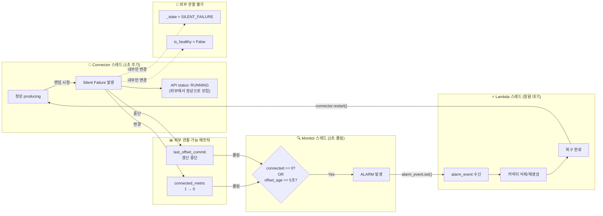

# MSK Connect Debezium Silent Failure 감지/복구 데모

## 구성

```
demo/
├── simulate_silent_failure.py   # 로컬 시뮬레이션 (3개 독립 스레드로 실시간 감지/복구)
├── lambda/
│   └── auto_recovery.py         # AWS Lambda 자동 복구 함수 (실제 배포용)
├── cloudformation.yaml          # 전체 파이프라인 배포 템플릿 (알람+EventBridge+Lambda+SNS)
└── README.md
```

---

## 소스코드 설명

### simulate_silent_failure.py

3개의 독립 스레드가 동시에 동작하여 실제 감지/복구를 시뮬레이션합니다.

| 스레드 | 역할 | 실제 AWS 대응 |
|--------|------|-------------|
| `connector_thread` | 정상 producing → 랜덤 시점에 silent failure 발생 | Debezium MSK Connector |
| `monitor_thread` | 외부 메트릭만 폴링하여 이상 감지 | CloudWatch Alarm |
| `recovery_thread` | 알람 수신 시 커넥터 자동 재시작 | EventBridge → Lambda |

### lambda/auto_recovery.py

실제 AWS에 배포하는 Lambda 함수입니다.

- CloudWatch Alarm → EventBridge 이벤트를 수신
- MSK Connect API로 커넥터 삭제 (`delete_connector`)
- S3에 저장된 설정으로 커넥터 재생성 (`create_connector`)
- SNS로 복구 결과 알림

### cloudformation.yaml

원클릭 배포 템플릿. 아래 리소스를 한 번에 생성합니다:

| 리소스 | 역할 |
|--------|------|
| CloudWatch Alarm x3 | Connected, Offset Commit, Lag 감지 |
| CloudWatch Logs Metric Filter | Offset Commit 로그 → 메트릭 변환 |
| EventBridge Rule | 알람 → Lambda 트리거 |
| Lambda | 커넥터 삭제 → 재생성 자동 복구 |
| SNS Topic | 이메일 알림 |
| EventBridge Schedule (비활성) | 예방적 주기 재시작 (필요 시 활성화) |

---

## 감지 메커니즘 상세

### 스레드 간 관계



### Monitor가 보는 것 vs 못 보는 것

Monitor는 커넥터의 내부 상태를 모릅니다. 실제 CloudWatch와 동일하게 **외부에서 관찰 가능한 메트릭만** 사용합니다.

**볼 수 있는 것 (실제 CloudWatch에 대응):**

| 데모 변수 | 실제 AWS | 설명 |
|----------|---------|------|
| `connector.connected_metric` | CloudWatch `MSK_Connect/Connected` | Debezium JMX → CloudWatch |
| `connector.last_offset_commit` 경과 시간 | Logs Metric Filter "Committing offsets" 카운트 | 로그 기반 메트릭 |

**볼 수 없는 것 (실제와 동일하게 차단):**

| 데모 변수 | 설명 |
|----------|------|
| `connector._state` (SILENT_FAILURE) | 커넥터 내부 상태 — 외부에 노출 안 됨 |
| `connector.is_healthy` | 내부 property |
| `connector.get_api_status()` | Silent Failure에서도 "RUNNING" 반환 |

### Monitor 감지 로직

```python
# 2초마다 폴링
connected = connector.connected_metric
offset_age = (now - connector.last_offset_commit).total_seconds()

# 감지 조건 (2가지 OR)
if connected == 0:                    # 조건 1: Connected 메트릭 = 0
    → ALARM
if offset_age >= 5:                   # 조건 2: offset commit 5초 이상 중단
    → ALARM
```

2중 감지를 사용하는 이유:
- `Connected=0`이 가장 빠르지만, 모든 silent failure에서 이 메트릭이 바뀌는지 보장 불가
- Offset commit 중단은 어떤 유형의 장애든 반드시 나타나는 증상이므로 보조 감지로 사용

### 감지 → 복구 흐름 (실제 로그)

```
20:04:38  [Connector] Committing offsets for 90 msgs | Connected: 1    ← 마지막 정상 producing
20:04:38  [ Monitor ] OK — Connected: 1, Offset age: 1s               ← 정상 판단

20:04:39  [Connector] SILENT FAILURE 발생!                              ← 내부에서만 상태 변경
20:04:39  [Connector] (silence) msgs: 0 | API status: RUNNING          ← API는 여전히 RUNNING!

20:04:40  [ Monitor ] ALARM! Connected=0 → Lambda 트리거               ← 1초 만에 감지
20:04:40  [  Lambda ] 알람 수신! API=RUNNING, Connected=0               ← 복구 시작
20:04:40  [  Lambda ] 커넥터 삭제/재생성 시작...

20:04:43  [  Lambda ] 커넥터 복구 완료! (재시작 #1)                       ← 3초 후 복구
20:04:43  [Connector] Committing offsets for 170 msgs | Connected: 1   ← 정상 producing 재개
20:04:44  [ Monitor ] OK → 알람 해제                                    ← 정상 확인
```

**장애 발생 → 감지: ~1-2초 / 감지 → 복구 완료: ~3초 / 총: ~4-5초**

### 실제 AWS 환경 예상 시간

| 단계 | 데모 | 실제 AWS |
|------|------|---------|
| 장애 발생 → 감지 | 1~2초 | 2~5분 (CloudWatch Alarm Period 60s x 2) |
| 감지 → Lambda 트리거 | 즉시 | 수초 (EventBridge) |
| 커넥터 삭제 대기 | 3초 | 3~5분 (MSK Connect API) |
| 커넥터 재생성 | 즉시 | 3~5분 (MSK Connect API) |
| **총 복구 시간** | **~5초** | **~10-15분** |

---

## 아키텍처

```
Debezium Connector (MSK Connect)
    │
    ├─ Connected=0 ──→ CloudWatch Alarm ──→ EventBridge ──→ Lambda ──→ 커넥터 재생성
    │                                                          │
    ├─ Offset Commit 중단 ──→ Logs Metric Filter ──→ Alarm ──┘
    │                                                          │
    └─ (선택) 매일 새벽 2시 ──→ EventBridge Schedule ──────────┘
                                                               │
                                                               └──→ SNS → 이메일 알림
```

---

## 실행 방법

### 1. 로컬 시뮬레이션

```bash
python3 simulate_silent_failure.py
```

40초간 동작하며 silent failure → 감지 → 복구 사이클을 2~3회 관찰할 수 있습니다.
Ctrl+C로 조기 종료 가능.

### 2. AWS 배포

#### 사전 준비

커넥터 재생성에 사용할 설정을 S3에 JSON으로 업로드:

```bash
aws s3 cp connector-create-config.json s3://my-bucket/debezium/connector-config.json
```

#### CloudFormation 배포

```bash
aws cloudformation deploy \
  --template-file cloudformation.yaml \
  --stack-name debezium-auto-recovery \
  --capabilities CAPABILITY_NAMED_IAM \
  --parameter-overrides \
    ConnectorArn="arn:aws:kafkaconnect:ap-northeast-2:ACCOUNT_ID:connector/debezium-connector-cdc/..." \
    ConnectorConfigS3Bucket="my-bucket" \
    ConnectorConfigS3Key="debezium/connector-config.json" \
    AlertEmail="oncall@example.com"
```
