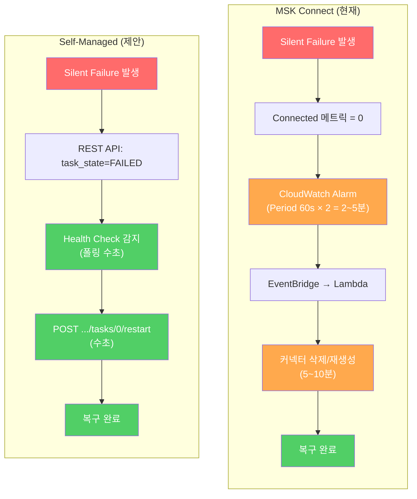

# Self-Managed Kafka Connect 데모 — MSK Connect 대안

## 왜 Self-Managed인가?

MSK Connect의 근본적 한계: **커넥터 내부 상태를 볼 수 없음**

```
MSK Connect:    GET /connectors/.../status  →  접근 불가
Self-Managed:   GET /connectors/.../status  →  {"tasks":[{"state":"FAILED"}]}
```

이 차이가 감지/복구 시간을 **10~15분 → ~10초**로 줄입니다.

## 구성

```
demo-self-managed/
├── docker-compose.yml           # 로컬 테스트 환경 (MySQL + Kafka + Kafka Connect)
├── init.sql                     # 테스트 DB/테이블 생성
├── register-connector.json      # Debezium 커넥터 설정
├── demo.sh                      # 전체 데모 (구축→CDC→장애→감지→복구)
├── health_check.sh              # Health check + 자동 복구 스크립트
├── simulate_comparison.py       # MSK Connect vs Self-Managed 비교 시뮬레이션
├── ecs/
│   └── cloudformation.yaml      # ECS Fargate 배포 템플릿
└── README.md
```

---

## 데모 1: 비교 시뮬레이션 (Docker 불필요)

MSK Connect와 Self-Managed에서 동일한 Silent Failure가 발생했을 때 차이를 비교합니다.

```bash
python3 simulate_comparison.py
```

6개 스레드(각 환경 3개씩)가 동시에 동작하며 감지/복구 속도 차이를 실시간으로 보여줍니다.

---

## 데모 2: 실제 Kafka Connect 환경 (Docker 필요)

실제 MySQL + Kafka + Debezium 환경에서 장애를 일으키고 REST API로 감지/복구합니다.

### 사전 요구

- Docker, Docker Compose

### 전체 데모 실행

```bash
chmod +x demo.sh health_check.sh
./demo.sh
```

단계별로 진행됩니다:

| Step | 내용 |
|------|------|
| 1 | docker-compose로 MySQL + Kafka + Kafka Connect 구축 |
| 2 | Debezium 커넥터 등록 |
| 3 | REST API로 상태 확인 (MSK Connect에서는 불가능한 것) |
| 4 | MySQL INSERT → Kafka 토픽 CDC 확인 |
| 5 | MySQL 연결 강제 끊기 (장애 시뮬레이션) |
| 6 | REST API로 FAILED 감지 |
| 7 | Task 즉시 재시작 |
| 8 | 복구 후 CDC 정상 동작 확인 |

### Health Check 단독 실행

커넥터가 이미 동작 중인 상태에서 모니터링만 실행:

```bash
./health_check.sh
```

### 정리

```bash
docker compose down -v
```

---

## 감지 메커니즘 비교



### REST API — MSK Connect에서 불가능, Self-Managed에서 가능한 것

```bash
# 커넥터 목록
GET /connectors

# 커넥터 + Task 상태 (핵심!)
GET /connectors/{name}/status
→ {
    "connector": {"state": "RUNNING"},
    "tasks": [{"id": 0, "state": "FAILED", "trace": "...에러 상세..."}]
  }

# Task 단위 재시작 (수초)
POST /connectors/{name}/tasks/0/restart

# 커넥터 전체 재시작 (includeTasks)
POST /connectors/{name}/restart?includeTasks=true

# 일시정지 / 재개
PUT /connectors/{name}/pause
PUT /connectors/{name}/resume
```

### 비교 표

|  | MSK Connect | Self-Managed (ECS) |
|--|:-----------:|:------------------:|
| Task 상태 조회 | 불가 | `GET /status` |
| Task 재시작 | 불가 (삭제/재생성) | `POST /tasks/0/restart` |
| 감지 소요 | 2~5분 | 수초 |
| 복구 소요 | 5~10분 | 수초 |
| **총 복구 시간** | **10~15분** | **~10초** |
| 인프라 관리 | 없음 (관리형) | ECS Task 관리 필요 |
| Consumer 변경 | 불필요 | 불필요 |
| Zombie Thread | 없음 | 없음 |

---

## AWS 배포 (ECS Fargate)

### 아키텍처

```
┌─────────────────────────────────────────────┐
│ ECS Fargate Task                            │
│                                             │
│  ┌─────────────────┐  ┌──────────────────┐  │
│  │ Kafka Connect   │  │ Health Check     │  │
│  │ (Debezium)      │  │ Sidecar          │  │
│  │                 │  │                  │  │
│  │ :8083 REST API ←┼──┤ 10초마다 폴링     │  │
│  │                 │  │ FAILED → restart  │  │
│  └────────┬────────┘  └──────────────────┘  │
│           │                                  │
└───────────┼──────────────────────────────────┘
            │
    ┌───────┴───────┐
    │   MSK Cluster  │
    └───────┬───────┘
            │
    ┌───────┴───────┐
    │  Aurora MySQL   │
    └────────────────┘
```

### 배포

```bash
aws cloudformation deploy \
  --template-file ecs/cloudformation.yaml \
  --stack-name kafka-connect-self-managed \
  --capabilities CAPABILITY_NAMED_IAM \
  --parameter-overrides \
    VpcId="vpc-xxx" \
    SubnetIds="subnet-aaa,subnet-bbb" \
    MSKBootstrapServers="b-1.xxx:9092,b-2.xxx:9092" \
    MSKSecurityGroupId="sg-xxx" \
    AlertEmail="oncall@example.com"
```

### 배포 후 커넥터 등록

ECS Task의 Private IP를 확인한 후:

```bash
curl -X POST -H "Content-Type: application/json" \
  -d @register-connector.json \
  http://<ECS_TASK_IP>:8083/connectors
```
